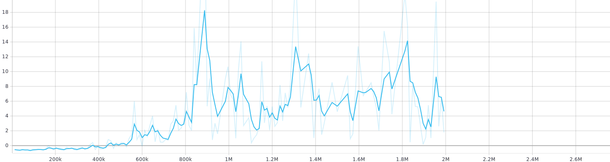

# Pong Reinforcement Learning
## Introduction

My objective with this project was to learn, as much as possible, about Reinforcement Learning. This field was completely new to me and after some research, some videos and inspiration by DeepMind, I decided that I was going to develop a project related to the RL and the videogames.

My objective was to create an AI able to learn to play some game by itself. The game that I chose for this project was the classic Pong because it's very simple and can be easily integrated into a browser.

For the technologies, I decided to use Unity as a game engine because I had previously developed some games with it. For the implementation of the AI, I decided to use the Unity package ML-Agents. This package allows you to use your own models or using existing architectures like PPO (the one I am going to use).

## Configuration of the environment

There are 3 things you have to do when you are developing some RL project: create the environment, define the reward function and define the sensors (the way our agent is going the see the "world").

The environment is the game itself. I coded a very basic 2D version of Pong using the Unity game engine.

Once the game is fully coded, is time to develop the hard-coded AI that will play against our RL based AI. This approach may be confusing, and the state-of-the-art techniques for training our RL models might be different, but, for this little project, it worked. The logic of the hard-coded AI is very simple: it just moves vertically based on the actual position of the ball.

Once the environment is created, is time for the rewards. The rewards are very important because they are in charge of telling how good or how bad your agent is working and allow them to modify their behaviour. I experimented with a few different options and the final rewards that worked for my project are:

* **+1** - If the agents score a point
* **+0.1** - If the agent hits the ball
* **-1** - If the agents receive a point
* **-0.001** - If the agent moves

The last thing to configure on our agent is maybe the most important one, the sensors. The agent needs a way to get information from the environment and my choice was a semicircle of rays that will detect the presence of the ball.

## Training

Now that everything is ready we are able to start training our agent. In order to train the model, I have used the package provided by Unity to train our models. Regarding the architecture I have used the PPO architecture, introduced by OpenAI, that is already implemented in the ML-Agents package. With respect to the training epochs, the perfect number is 2 million. With less than 1 Million is very easy to beat the AI and with more than 2 the improvement is unnoticeable.

https://user-images.githubusercontent.com/46010361/176516518-3777c689-1254-4dcb-84a2-102bfb1edbc0.mp4

Now that the model has been fully trained, we can see some graphs with information about the training.

First of all, the training with only 500K training epochs (the vertical axis represents the mean accumulated reward):

Now with 2M training epochs:

The last graph represents the loss function of the training over the 2M training epochs:

## Demo

Now that our model is fully trained, we can proceed to integrate the game into the browser. Thanks to Unity the process is just a few clicks and the game is exported and ready to play. On the demo part, you will be able to play against the AI trained in this project.

https://user-images.githubusercontent.com/46010361/176517837-2b5f4c3c-78bb-4b88-baf1-7e53794f6a98.mp4

## Conclusion
This project has helped me to learn a completely new machine learning paradigm. It was very satisfying to start learning something from 0 and create a working project in 2 weeks. I've learned a lot regarding this topic and I still have lots of documentation to read and improve my knowledge in this area.

However, not everything was so easy. During the development of this project, I've experimented some difficulties to overcome. When you are new in a certain area and you try to implement something, if errors appear, is going to be very difficult to debug these errors. In addition, my computer is quite old and in order to train this simple model takes more than 4 hours, which is a quite deterrent for doing future complex projects.

